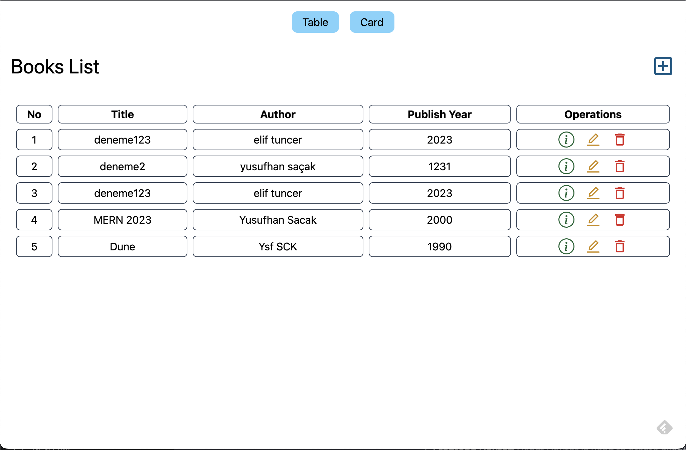
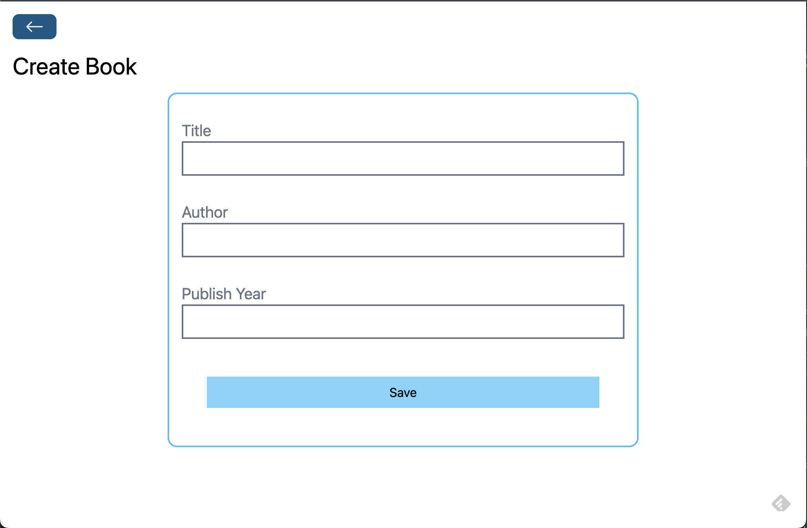
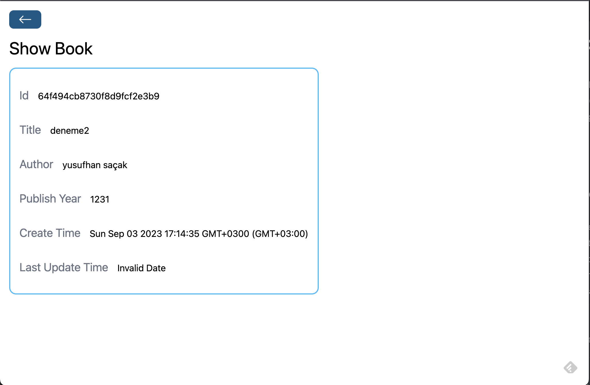
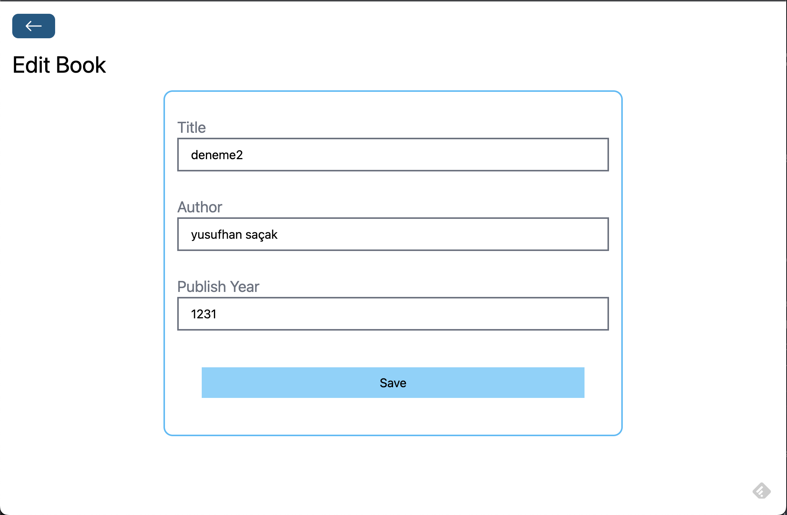
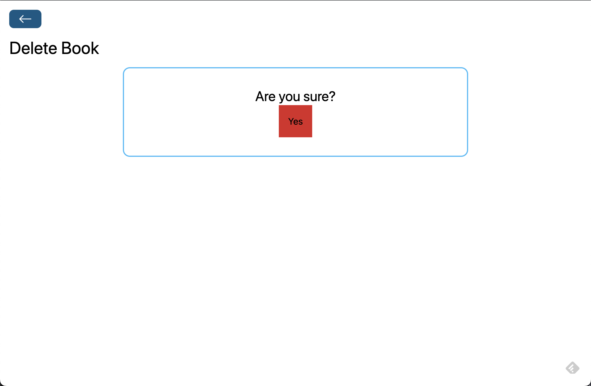

# Book Store Project (MERN Stack)


## Description

This is a simple Book Store Project built using the MERN (MongoDB, Express.js, React, and Node.js) stack. This project demonstrates basic CRUD (Create, Read, Update, Delete) operations on both the backend and frontend, including routing and CORS policy configuration.

Video Tutorial: https://www.youtube.com/watch?v=-42K44A1oMA&t=4s
## Features

- **Backend CRUD:** The backend of this project provides CRUD operations for managing books. You can create, read, update, and delete books using the API endpoints.
- **Backend Router:** Express.js is used to set up the backend routing. Each CRUD operation has its own route and controller for clean code separation.
- **CORS Policy:** Cross-Origin Resource Sharing (CORS) policy is configured to allow requests from the frontend to the backend, ensuring proper communication between the two.
- **MongoDB Operations:** MongoDB is used as the database for storing book information. The backend performs database operations such as creating, reading, updating, and deleting records.
- **Frontend CRUD:** The frontend of the project provides a user interface for performing CRUD operations on books. You can add new books, view existing books, edit book details, and delete books.
- **Frontend Router:** React Router is used to create client-side routing, allowing seamless navigation between different pages of the frontend application.

## Screenshots









## Getting Started

Follow the steps below to set up the project on your local machine and run it:

1. Clone the repository:

```bash
git clone https://github.com/JosephDoUrden/Book-Store-Project
cd book-store-project
```

2. Backend Setup:

```bash
cd backend
npm install
```

- Configure the MongoDB connection by creating a .env file with your MongoDB URI:
```
MONGODB_URI=mongodb://localhost:27017/bookstore
```

- Start the backend server:
```
npm run dev
```

3. Frontend Setup(new terminal):
```
cd frontend
npm install
npm run dev
```

## Technologies Used
### Backend:
- Node.js
- Express.js
- MongoDB

### Frontend:

- Vite
- React


## Contact

If you have any questions, feedback, or would like to connect, feel free to reach out to me.

- **Name:** Yusufhan Saçak
- **Email:** yusufhan.sacak@bahcesehir.edu.tr
- **Website:** https://medium.com/@yusufhansacak
- **Twitter:** [@0xSCK](https://twitter.com/0xSCK)
- **LinkedIn:** [Yusufhan Saçak](https://www.linkedin.com/in/yusufhansacak/)

Feel free to contact me through any of the channels above. I'm open to collaborations and discussions related to Flutter development or any other projects.

## Overview

MERN-BookStore is a comprehensive web application built using the MERN stack (MongoDB, Express.js, React.js, and Node.js) that allows users to efficiently manage and operate a books collection. This project incorporates essential CRUD (Create, Read, Update, Delete) operations to handle books, authors, and other relevant data within the bookstore's inventory.

## Getting Started🚀 

1. Clone this repository.
2. Install the necessary dependencies using `npm install`.
3. Make changes in both client and server folders.
4. Add required fields in the .env file.
5. Set up MongoDB Atlas server.
6. That's it, you are all set now!

## Key Features

1. 🔐 **User Authentication:**
   - Secure user registration and login system for both customers and bookstore staff.
   - Differentiate between admin and regular user roles to control access and privileges.

2. 📖 **Book Management:**
   - Create, read, update, and delete books in the app.
   - Associate books with authors, genres, and categories.

3. 👨‍💼 **Author Management:**
   - Link authors to their respective books for easy navigation.

4. 📚 **Genre Management:**
   - Add, edit, and delete genres and categories as needed.

5. 🌟 **User-Friendly Interface:**
   - Utilize React.js to create a responsive and user-friendly front-end.
   - Intuitive and visually appealing design for a smooth user experience.

6. 🔒 **Security and Validation:**
    - Implement authentication and authorization mechanisms to secure data.
    - Validate user inputs to prevent malicious actions.

7. 🚀 **Scalability and Performance:**
    - Optimize database queries and server routes for improved performance.
    - Prepare the application for potential scaling by using best practices.

## Technologies Used

- 🌐 **Front-end:** React.js, HTML/CSS, JavaScript
- ⚙️ **Back-end:** Node.js, Express.js
- 🗃️ **Database:** MongoDB
- 🔑 **Authentication:** JSON Web Tokens (JWT)
- 🔄 **Version Control:** Git
- ☁️ **Deployment:** Vercel or other suitable platforms

## Project Structure

`1)` `frontend`: 
- `Connection`: Manages the database connection.
- `Controllers`: Handles request handling and business logic.
- `Models`: Defines data models/schema for the database.
- `Middlewares`: Implements middleware functions for request handling.
- `Routes`: Defines API routes for the application.
- `utils`: Houses utility functions and helper modules.

`2)` `backend`:
- `Assets`: Stores static assets like images and styles.
- `Components`: Contains reusable React components.
- `Pages`: Defines the main application pages.

## Project Goals

MERN-BookStore aims to provide an efficient and user-friendly platform for managing books and their online operations. It empowers owners to easily add, update, and remove books while offering customers a seamless experience. The project demonstrates proficiency in the MERN stack and CRUD operations, making it a valuable showcase of your web development skills.

## Future Enhancements

- Implement payment processing for online orders.
- Include a recommendation system based on user preferences and past purchases.
- Enhance the user interface and add features like book previews, wishlists, and social sharing.
- Enable integration with external APIs for book data and reviews.

## Contributing

Contributions to the MERN-BookStore are welcome! Please follow these steps:

1. 🍴 Fork the repository.
2. 🌿 Create a new branch for your feature or fix.
3. 🛠️ Make your changes and commit them.
4. 🚀 Push your changes to your fork.
5. 🔄 Create a pull request to the main repository.

Contributions and feedback are welcome! If you find any issues or have suggestions for improvements, please feel free to submit a pull request or open an issue. Please follow the contribution guidelines.

👨‍💻 **Author**: Dinesh (@Dinesh33)

